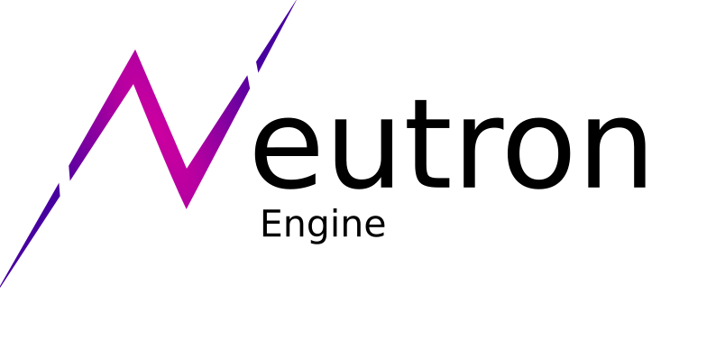

<picture>
  <source media="(prefers-color-scheme: dark)" srcset="../branding/typespace-logo-light.png">
  
</picture>

### This organisation contains a group of tools used to create NeutronEngine (And ofcourse NeutronEngine itself)

---

cool.
